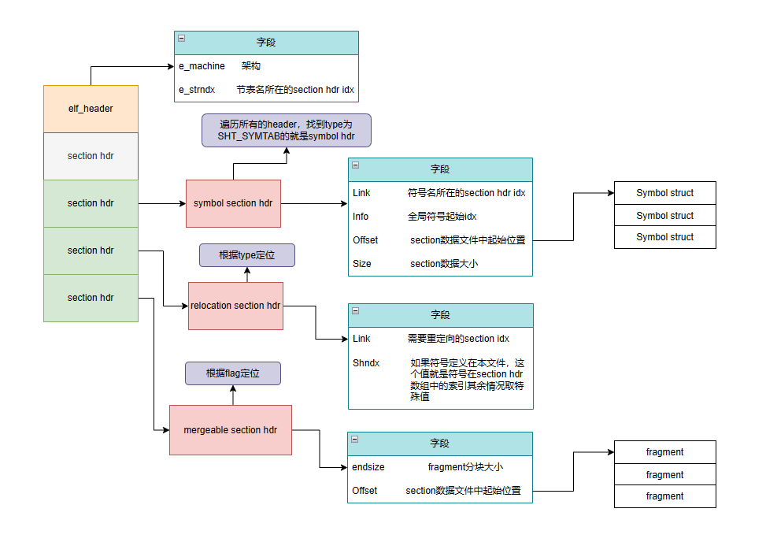

# easy_linker

## 介绍

一款64位RISC-V指令集的静态链接器，目前只支持解析ELF文件格式，后续会加入PE的支持。

## 交叉编译工具
- sudo apt upgrate                                 
- sudo apt install qemu-user                       
- sudo apt search risc                             
- sudo apt install gcc-12-riscv64-linux-gnu        
- sudo ln -sf /usr/bin/riscv64-linux-gnu-gcc-12 /usr/bin/riscv64-linux-gnu-gcc                              

## linker大致流程
- Command line options
- Symbol resolution (including archive processing)
- Process input sections
- Section based garbage collection / identical code folding
- Create synthetic (linker generated) sections
- Scan relocations
- Create output sections
- Assign input sections to output sections
- Write file header
- Write sections

## ELF目标文件结构

